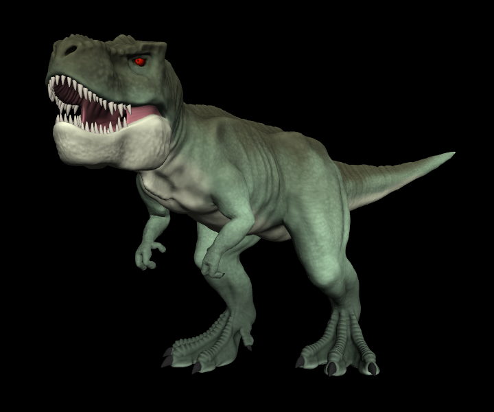

# scale-scope
View 3D models and sequences interactively.



## Build
Have [Stack](https://docs.haskellstack.org/) installed.

```bash
stack build
stack install
```

## Usage
This project includes two executables.
`scale-pack` packs an OBJ file (or a sequence of them) into a custom format.
`scale-scope` visualizes the resulting file using SDL2 and OpenGL3.

### Packing files
Call the `scale-pack` program with the input OBJ files as positional arguments
and the output filename given to the `-o` option.
Example:

```bash
scale-pack data/pyramid.obj -o data/pyramid.ssc
```

Multiple OBJ files can be packed together as an animation sequence.
See `scale-pack -h` for advanced options.

### Viewing files
Launch the `scale-scope` with the output of `scale-pack` given as an argument.
Example:

```bash
scale-scope data/rex-walk-20hz-lvl0.ssc
```

The program's working directory must include the shader/ directory.

While the program is running, it also accepts files to display via
drag&drop onto its window.

Interactive commands:

| Key | Action |
| --- | ------ |
| LMB drag | Rotate view |
| Scroll / MMB drag | Zoom view |
| Escape | Exit |
| P | Toggle pause |
| , . | Step back/forward |
| [ ] | Playback rate up/down |
| \ | Reverse playback |
| F5 | Reload shaders |
| F11 | Toggle fullscreen |

(LMB, MMB, RMB stand for left/middle/right mouse button)
